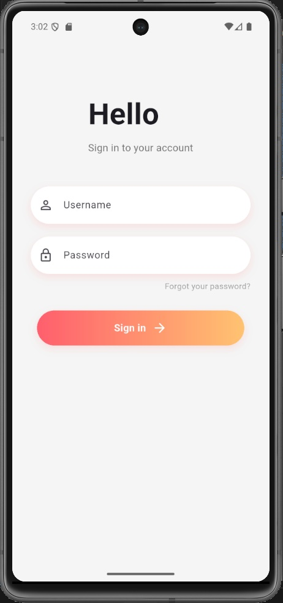
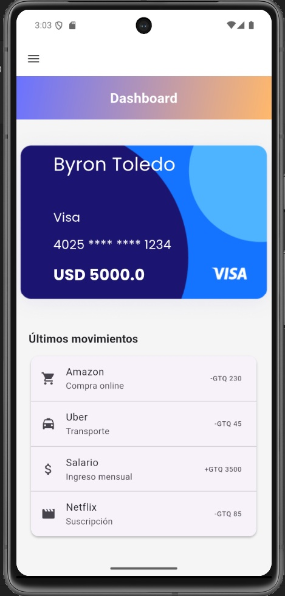
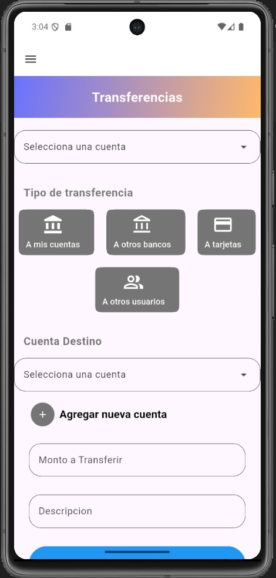
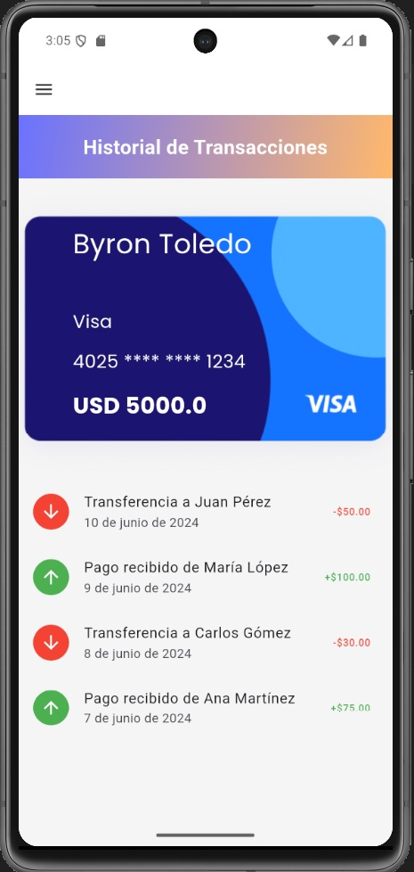

# App Bancaria Flutter

## Descripción del Proyecto

Aplicación bancaria desarrollada en Flutter con estándares profesionales, siguiendo arquitectura limpia y mejores prácticas de desarrollo mobile.

---

## Participantes

- **Henry Gabriel Peralta Martinez**
- **Byron Steven Toledo Medina**

---

## Objetivos del Proyecto

### Objetivos Generales

1. **Configuración Profesional**
   - Inicializar proyecto Flutter con estándares de calidad
   - Implementar Material 3 para UI moderna
   - Configurar linter y formatter automático
   - Establecer estructura base de carpetas consistente

2. **Sistema de Navegación**
   - Implementar navegación base entre principales secciones
   - Crear pantallas de: Login, Dashboard, Transferencias, Historial y Configuración
   - Assegurar transiciones fluidas entre secciones

3. **Características Bancarias**
   - Autenticación de usuarios
   - Visualización de dashboard
   - Gestión de transferencias
   - Historial de transacciones
   - Configuración de cuenta

---

## Cómo Ejecutar el Proyecto

### Requisitos Previos

- Flutter SDK (versión 3.x o superior)
- Dart SDK
- Android Studio
- Emulador o dispositivo físico

### Pasos de Instalación

1. **Clonar el repositorio**
   ```bash
   git clone git@github.com:HenryPeralta/proyecto_flutter.git
   cd proyecto_flutter
   ```

2. **Obtener dependencias**
   ```bash
   flutter pub get
   ```

3. **Ejecutar la aplicación**
   ```bash
   flutter run
   ```

4. **Ejecutar en dispositivo específico (opcional)**
   ```bash
   flutter run -d <device-id>
   ```

### Comandos Útiles

```bash
# Limpiar build
flutter clean

# Formatear código
dart format .
```

---

## Arquitectura

El proyecto utiliza **Clean Architecture** con las siguientes capas:

```
lib/
├── core/                 # Configuración global y utilidades
│   ├── app_colors.dart
│   ├── assets.dart
│   ├── constants/
│   ├── theme/            # Tema y estilos
│   └── widgets/          # Widgets reutilizables
│
├── features/             # Funcionalidades principales
│   ├── auth/             # Módulo de autenticación
│   ├── dashboard/        # Pantalla principal
│   ├── history/          # Historial de transacciones
│   └── transfers/        # Transferencias
│
└── routes/               # Navegación y rutas
```

### Características de la Arquitectura

- **Separación de responsabilidades**: Cada feature es independiente
- **Reutilización**: Widgets y utilidades comunes en `core/`
- **Escalabilidad**: Fácil agregar nuevas features
- **Mantenibilidad**: Código organizado y predecible
- **Material 3**: Diseño moderno y consistente

---

## Capturas de Pantalla

### Pantalla de Login


### Dashboard


### Transferencias


### Historial

---

## Configuración del Proyecto

- **Linter**: Configurado en `analysis_options.yaml`
- **Formatter**: Dart Format automático
- **Material Design**: Material 3
- **Estado**: Preparado para gestión de estado (Provider, Riverpod, Bloc, etc.)

---

## Notas de Desarrollo

- Seguir las normas definidas en `analysis_options.yaml`
- Mantener la estructura de carpetas consistente
- Documentar funciones públicas
- Realizar pruebas antes de crear PRs

---
